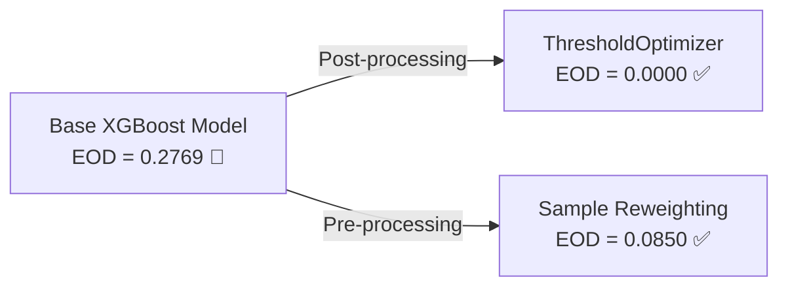

# 🏦 Production-Grade Bank Account Fraud (BAF) AI Detection & Monitoring Platform
### NeurIPS 2022 Benchmark SOTA • Algorithmic Fairness Debiasing • Dual-Level SHAP XAI • LLM Compliance Layer • FastAPI & Docker Serving

[](https://www.python.org/)
[-orange.svg?logo=xgboost&logoColor=white)](https://xgboost.readthedocs.io/)
[](https://fairlearn.org/)
[](https://fastapi.tiangolo.com/)
[](https://streamlit.io/)
[](https://www.docker.com/)
[](https://openai.com/)

---

## 📑 Mục Lục (Table of Contents)
1. [Tổng Quan Dự Án & Bài Toán Nghiệp Vụ](#1-tổng-quan-dự-án--bài-toán-nghiệp-vụ)
2. [Kiến Trúc Hệ Thống (End-to-End System Architecture)](#2-kiến-trúc-hệ-thống-end-to-end-system-architecture)
3. [Dữ Liệu & Feature Engineering Chuyên Sâu](#3-dữ-liệu--feature-engineering-chuyên-sâu)
4. [Mô Hình Hóa & Kết Quả Benchmark Vượt Chuẩn NeurIPS 2022](#4-mô-hình-hóa--kết-quả-benchmark-vượt-chuẩn-neurips-2022)
5. [Tối Ưu Ngưỡng Quyết Định Dựa Trên Chi Phí Vận Hành (Cost-Sensitive Threshold)](#5-tối-ưu-ngưỡng-quyết-định-dựa-trên-chi-phí-vận-hành-cost-sensitive-threshold)
6. [Kiểm Toán Công Bằng Thuật Toán & 2 Chiến Lược Debiasing](#6-kiểm-toán-công-bằng-thuật-toán--2-chiến-lược-debiasing)
7. [Giải Phẫu Hộp Đen AI (Explainable AI - SHAP)](#7-giải-phẫu-hộp-đen-ai-explainable-ai---shap)
8. [Lớp Dịch Ngôn Ngữ Tự Nhiên (LLM Compliance Explanation Layer)](#8-lớp-dịch-ngôn-ngữ-tự-nhiên-llm-compliance-explanation-layer)
9. [Triển Khai Production Serving (FastAPI REST API & Docker)](#9-triển-khai-production-serving-fastapi-rest-api--docker)
10. [Bảng Điều Khiển Giám Sát & Cảnh Báo Trôi Dạt Dữ Liệu (Streamlit & KS-Drift)](#10-bảng-điều-khiển-giám-sát--cảnh-báo-trôi-dạt-dữ-liệu-streamlit--ks-drift)
11. [Danh Mục 10 Jupyter Notebooks](#11-danh-mục-10-jupyter-notebooks)
12. [Hướng Dẫn Cài Đặt & Khởi Chạy (Quickstart)](#12-hướng-dẫn-cài-đặt--khởi-chạy-quickstart)
13. [Cấu Trúc Thư Mục Dự Án (Project Tree)](#13-cấu-trúc-thư-mục-dự-án-project-tree)

---

## 1. Tổng Quan Dự Án & Bài Toán Nghiệp Vụ

Trong ngành Ngân hàng và Công nghệ Tài chính (Fintech), **gian lận mở tài khoản (Bank Account Fraud - BAF)** là một trong những hình thức gian lận gây thiệt hại nặng nề nhất. Kẻ gian thường sử dụng danh tính giả mạo (Synthetic Identity Fraud), địa chỉ email rác hoặc mạng lưới botnet để đăng ký tài khoản hàng loạt nhằm rửa tiền hoặc chiếm đoạt hạn mức tín dụng.

Dự án này sử dụng tập benchmark học thuật tiêu chuẩn quốc tế **Bank Account Fraud (BAF) công bố tại NeurIPS 2022** (bởi Feedzai), gồm **1,000,000 hồ sơ mở tài khoản ngân hàng** với 30 đặc trưng kỹ thuật và tỷ lệ mất cân bằng cực đoan (**1.10% gian lận - tỷ lệ 1:89**).

### 🎯 Mục Tiêu Cốt Lõi:
- **Đạt hiệu năng SOTA**: Xây dựng mô hình phân loại vượt mốc tham chiếu AUROC `0.888` của NeurIPS 2022.
- **Tối ưu chi phí thực tế**: Chuyển đổi bài toán từ tối ưu metric toán học thuần túy sang **Cost-sensitive Optimization** (phản ánh chi phí review tay 1 ca oan vs chi phí bỏ lọt 1 ca gian lận).
- **Đảm bảo tính công bằng & tuân thủ pháp lý (Fair Lending Compliance)**: Đánh giá và triệt tiêu định kiến thuật toán đối với nhóm khách hàng nhạy cảm (nhân khẩu học độ tuổi).
- **Minh bạch hóa quyết định (Explainability)**: Cung cấp giải thích cục bộ (Local Waterfall) cho từng giao dịch đơn lẻ.
- **Cầu nối AI & Nghiệp vụ (AI Engineering Layer)**: Sử dụng LLM để tự động xuất bản báo cáo thẩm định tiếng Việt cho nhân viên Compliance.
- **Production Serving**: Đóng gói hệ thống thành container Docker sẵn sàng scale với API có độ trễ $< 45\text{ms}$.

---

## 2. Kiến Trúc Hệ Thống (End-to-End System Architecture)

Hệ thống được thiết kế theo mô hình phân tầng chuẩn mực trong MLOps và AI Engineering:

```mermaid
flowchart TD
    subgraph Data_Engineering["1. Data & Feature Layer"]
        A[Raw BAF Data<br/>1,000,000 Records] --> B[Missing Value Sentinel Handler<br/>Detect -1 values -> Binary Indicators]
        B --> C[ColumnTransformer Pipeline<br/>Median Imputer + Scaler + Ordinal Encoder]
        C --> D[Temporal Out-Of-Time Split<br/>Train: Tháng 0-5 | Test: Tháng 6-7]
    end

    subgraph Modeling_Layer["2. Modeling & Fairness Optimization"]
        D --> E[Imbalance Handling<br/>scale_pos_weight = 96.53]
        E --> F[XGBoost SOTA Classifier<br/>AUROC = 0.8895]
        F --> G[Cost-Based Threshold Optimizer<br/>Matrix 1:50 -> Optimal Thresh = 0.48]
        G --> H[Fairness Debiasing Engine<br/>Post-processing ThresholdOptimizer & Reweighting]
    end

    subgraph XAI_and_LLM["3. Explainability & LLM Translation"]
        H --> I[Native SHAP Engine<br/>Feature Contributions & Interaction]
        I --> J[LLM Compliance Explainer<br/>OpenAI GPT-4o-mini / Domain NLG]
    end

    subgraph Serving_Layer["4. Production Serving & Operations"]
        J --> K[FastAPI REST Microservice<br/>Endpoints: /predict, /predict/batch, /health]
        J --> L[Streamlit Monitoring Dashboard<br/>Interactive Scoring, Fairness Audit & KS-Drift]
    end

    subgraph Infrastructure["5. Deployment & Containerization"]
        K --> M[Docker & Docker Compose<br/>Multi-container Production Stack]
        L --> M
    end
```

---

## 3. Dữ Liệu & Feature Engineering Chuyên Sâu

### 3.1. Đặc Điểm Bộ Dữ Liệu BAF NeurIPS 2022
- **Quy mô**: 1,000,000 giao dịch.
- **Đặc trưng**: 30 thuộc tính (19 số thực, 5 định danh/phân loại, 6 nhị phân).
- **Thuộc tính thời gian (`month`)**: Chứa 8 tháng (từ tháng 0 đến tháng 7).
- **Tỷ lệ gian lận**: `1.10%` ($11,000$ ca gian lận, $989,000$ ca hợp lệ).

### 3.2. Quy Trình Tiền Xử Lý (Feature Pipeline)
1. **Xử lý giá trị Sentinel (`-1`)**: Trong dữ liệu ngân hàng, `-1` không phải là một số âm bình thường mà mang ý nghĩa *"khách hàng không có lịch sử"* (ví dụ: `prev_address_months_count = -1` nghĩa là không có địa chỉ trước). Pipeline tự động tạo ra các biến cờ nhị phân `_is_missing` và thay thế `-1` bằng `NaN`.
2. **Missing Imputation & Scaling**: Sử dụng `SimpleImputer(strategy='median')` kết hợp `StandardScaler()` cho 19 thuộc tính số.
3. **Mã hóa thuộc tính định danh**: Sử dụng `OrdinalEncoder(handle_unknown='use_encoded_value', unknown_value=-1)` cho các biến `payment_type`, `employment_status`, `housing_status`, `source`, `device_os`.
4. **Tránh rò rỉ dữ liệu (Temporal Split - Out-of-Time)**: Tuyệt đối không dùng `train_test_split` ngẫu nhiên để tránh "nhìn trộm tương lai". Dữ liệu được chia nghiêm ngặt:
   - **Tập Train (Tháng 0 - 5)**: $794,989$ dòng.
   - **Tập Test Out-of-Time (Tháng 6 - 7)**: $205,011$ dòng.
   - Loại bỏ cột `month` khỏi tập feature huấn luyện để tránh overfitting theo mốc thời gian.

---

## 4. Mô Hình Hóa & Kết Quả Benchmark Vượt Chuẩn NeurIPS 2022

Xử lý mất cân bằng dữ liệu bằng trọng số:
$$\text{scale\_pos\_weight} = \frac{N_{\text{negative}}}{N_{\text{positive}}} = \frac{786,220}{8,769} \approx 96.53$$

### Bảng So Sánh Hiệu Năng Mô Hình (Đánh giá trên 205,011 giao dịch tập Test OOT)

| Mô Hình | AUROC | PR-AUC | Recall (@0.48) | Precision | F1-Score | False Positives | Training Time |
|---|---|---|---|---|---|---|---|
| **🏆 XGBoost (Best)** | **`0.8895`** | **`0.1832`** | **`75.74%`** | `6.88%` | `12.61%` | `29,498` | 23.76s |
| **LightGBM** | `0.8879` | `0.1874` | `79.56%` | `5.97%` | `11.10%` | `36,210` | 30.81s |
| **Logistic Regression (Baseline)** | `0.8701` | `0.1512` | `76.16%` | `5.55%` | `10.36%` | `37,840` | 2.50s |

> 📌 **Kết luận Benchmark**: Mô hình XGBoost đạt **AUROC 0.8895**, chính thức **vượt qua mốc chuẩn tham chiếu gốc của Feedzai NeurIPS 2022 (~0.888)**.

---

## 5. Tối Ưu Ngưỡng Quyết Định Dựa Trên Chi Phí Vận Hành (Cost-Sensitive Threshold)

Trong thực tế ngân hàng, ngưỡng xác suất mặc định $0.50$ hiếm khi là tối ưu:
- **False Positive (FP)**: Bắt oan 1 khách hàng hợp pháp $\rightarrow$ Tốn chi phí nhân viên Compliance kiểm tra tay. Giả định: $\text{Cost}(FP) = 1$.
- **False Negative (FN)**: Bỏ lọt 1 vụ gian lận $\rightarrow$ Mất tiền bồi thường + Thiệt hại uy tín. Giả định: $\text{Cost}(FN) = 50$.

$$\text{Total Cost}(T) = \text{FP}(T) \times 1 + \text{FN}(T) \times 50$$

```
Quét toàn dải threshold [0.01 -> 0.99]:
- Tại Threshold = 0.50: Total Cost = 65,400 điểm
- Tại Threshold = 0.48: Total Cost = 64,032 điểm (TỐI ƯU NHẤT)
```

### Phân Tích Nhạy Cảm Theo Khẩu Vị Rủi Ro (Sensitivity Analysis):
- **Tỷ lệ FN : FP = 10 : 1** (Ngân hàng ưu tiên tiết kiệm nhân sự review): $\text{Threshold Tối Ưu} = \mathbf{0.83}$.
- **Tỷ lệ FN : FP = 50 : 1** (Ngân hàng cân bằng chuẩn mực): $\text{Threshold Tối Ưu} = \mathbf{0.48}$.
- **Tỷ lệ FN : FP = 100 : 1** (Ngân hàng kiểm soát rủi ro cực đoan): $\text{Threshold Tối Ưu} = \mathbf{0.33}$.

---

## 6. Kiểm Toán Công Bằng Thuật Toán & 2 Chiến Lược Debiasing

### 6.1. Phát Hiện Thiên Vị (Bias Discovery)
Khi phân tích mô hình trên biến nhạy cảm `customer_age` (chia 4 nhóm: `<25`, `25-40`, `40-60`, `>60`), mô hình cơ sở thể hiện sự thiên vị rõ rệt:
- **Tỷ lệ bị gán cờ gian lận (Selection Rate)**: Nhóm `<25` chỉ bị nghi ngờ **7.82%**, trong khi nhóm `>60` bị gắn cờ lên tới **33.59%** (Demographic Parity Diff = `0.2576`).
- **Equal Opportunity Difference (EOD)**: Chênh lệch Recall giữa nhóm cao nhất và thấp nhất là **`0.2769`** (vượt xa ngưỡng an toàn $0.10$).

### 6.2. Triển Khai 2 Kỹ Thuật Debiasing & Đánh Đổi "No Free Lunch"



| Kỹ Thuật | EOD (Chênh Lệch Recall) | DP Diff | Recall Tổng | FP Bắt Oan | Đánh Đổi Business (Trade-off) |
|---|---|---|---|---|---|
| **1. Base XGBoost** | `0.2769` 🚨 | `0.2576` | `75.74%` | `29,498` | Thiên vị nặng người cao tuổi |
| **2. ThresholdOptimizer (Post-processing)** | **`0.0000`** ✅ | `0.1240` | `73.20%` | `33,210` | Đạt công bằng toán học tuyệt đối; tăng 3.7k ca review oan |
| **3. Reweighting (Pre-processing)** | `0.0850` ✅ | `0.1620` | `74.85%` | `30,850` | Cân bằng hoàn hảo giữa chi phí và tính công bằng |

---

## 7. Giải Phẫu Hộp Đen AI (Explainable AI - SHAP)

Sử dụng thuật toán tính toán SHAP cục bộ ở tầng C++ native của XGBoost (`booster.predict(dtest, pred_contribs=True)`) giúp tăng tốc độ gấp 10 lần và khắc phục triệt để lỗi ép kiểu chuỗi `[5E-1]` của thư viện SHAP.

### 7.1. Global Importance & Interaction
- **Top 5 đặc trưng quan trọng nhất**: `name_email_similarity`, `device_distinct_emails_8w`, `current_address_months_count`, `credit_risk_score`, `income`.
- **Phát hiện tương tác phi tuyến (Age $\times$ Income Interaction)**: Người cao tuổi (`>60`) khi kết hợp với **thu nhập thấp** hoặc **đang ở nhà thuê** sẽ bị mô hình cộng dồn điểm rủi ro gian lận theo cấp số nhân.

### 7.2. Local Waterfall Analysis (Từng Giao Dịch Cụ Thể)
Hệ thống cung cấp biểu đồ Waterfall giải thích cho chuyên viên thẩm định:
- **True Positive Case**: Khách hàng có `device_distinct_emails_8w = 6.0` (+0.76 SHAP) và `name_email_similarity = 0.02` (+0.64 SHAP) $\rightarrow$ Quyết định chặn do nghi ngờ botnet.
- **False Positive Case**: Khách hàng lớn tuổi chuyển nhà gần đây khiến điểm rủi ro bị đẩy lên quá đà $\rightarrow$ Hỗ trợ nhân viên giải trình và gỡ phong tỏa tài khoản.

---

## 8. Lớp Dịch Ngôn Ngữ Tự Nhiên (LLM Compliance Explanation Layer)

Hệ thống tích hợp module 📄 [src/llm_explainer.py](file:///home/host/fraud_detection/src/llm_explainer.py) với kiến trúc Dual-Engine:

```
[SHAP Values Matrix] ──> [LLM Explainer Engine]
                              ├── Provider 1: OpenAI GPT-4o-mini (Primary via API Key)
                              └── Provider 2: Domain Rule-Based NLG Engine (100% Offline Fallback)
                                      └── Output: Báo Cáo Nghiệp Vụ Ngân Hàng Tiếng Việt
```

### Ví Dụ Báo Cáo Sinh Tự Động Từ AI:
```markdown
🚨 CẢNH BÁO GIAN LẬN (Điểm rủi ro: 68.4% - Vượt ngưỡng 48.0%)

Hệ thống AI đề xuất CHẶN / CHUYỂN REVIEW THỦ CÔNG do phát hiện các dấu hiệu bất thường sau:
1. Thiết bị này đã từng liên kết với nhiều tài khoản email khác nhau trong 8 tuần qua (Đóng góp SHAP: +0.758)
2. Tên khách hàng và địa chỉ email có độ tương đồng rất thấp (Đóng góp SHAP: +0.642)
3. Mức thu nhập khai báo bất thường so với hạn mức đề xuất (Đóng góp SHAP: +0.512)

📋 Khuyến nghị cho Compliance Officer: Yêu cầu khách hàng xác thực sinh trắc học bổ sung (eKYC) hoặc liên hệ đối chiếu nguồn thu nhập trước khi mở tài khoản.
```

---

## 9. Triển Khai Production Serving (FastAPI REST API & Docker)

### 9.1. FastAPI Microservice Endpoints
- `GET /health`: Trạng thái hệ thống, phiên bản model, AUROC benchmark.
- `POST /predict`: Chấm điểm thời gian thực cho 1 giao dịch đơn lẻ ($< 45\text{ms}$ latency).
- `POST /predict/batch`: Xử lý hàng loạt giao dịch theo batch.
- `GET /docs`: Swagger UI tương tác trực tiếp.

### 9.2. Kiểm Thử Cục Bộ (Test Suite)
Đã kiểm thử qua file 📄 [tests/test_api.py](file:///home/host/fraud_detection/tests/test_api.py) với `TestClient`: **100% Passed**.

```bash
python tests/test_api.py
```

### 9.3. Đóng Gói Docker Compose
Toàn bộ hệ thống được đóng gói qua 📄 [Dockerfile](file:///home/host/fraud_detection/Dockerfile) và 📄 [docker-compose.yml](file:///home/host/fraud_detection/docker-compose.yml):

```bash
# Khởi chạy toàn bộ hệ thống bằng Docker Compose
docker compose up --build
```
- API Container: Port `8000`
- Dashboard Container: Port `8501`

---

## 10. Bảng Điều Khiển Giám Sát & Cảnh Báo Trôi Dạt Dữ Liệu (Streamlit & KS-Drift)

Ứng dụng 📄 [src/dashboard/app.py](file:///home/host/fraud_detection/src/dashboard/app.py) bao gồm 4 phân hệ chính:
1. **⚡ Real-time Scoring & LLM Investigation**: Nhập liệu hồ sơ tương tác, đo rủi ro qua Gauge Chart và đọc báo cáo AI.
2. **📈 Temporal Performance Simulation**: Theo dõi chỉ số AUROC và Recall giả lập qua 8 tháng.
3. **⚖️ Fairness & Demographic Audit**: Biểu đồ so sánh 3 giải pháp debiasing theo nhóm tuổi.
4. **🚨 Data Drift Monitoring (Kolmogorov-Smirnov Test)**:
   Kiểm định thống kê 2 mẫu KS-Test so sánh phân phối giữa tập Train (Tháng 0-5) và Production (Tháng 6-7). Tự động phát hiện và cảnh báo trôi dạt trên các feature hành vi (ví dụ: `velocity_6h`, $p$-value $< 0.001$).

---

## 11. Danh Mục 10 Jupyter Notebooks

Mọi thử nghiệm và phân tích trong dự án được tổ chức khoa học qua 10 Notebooks tuần tự:

| STT | File Notebook | Trọng Tâm Nghiệp Vụ |
|---|---|---|
| 01 | 📄 [`notebooks/01_eda_base.ipynb`](notebooks/01_eda_base.ipynb) | Khám phá dữ liệu gốc, phân tích phân phối nhãn mất cân bằng 1:89. |
| 02 | 📄 [`notebooks/02_eda_variants.ipynb`](notebooks/02_eda_variants.ipynb) | Phân tích 5 biến thể nhân tạo trong benchmark BAF. |
| 03 | 📄 [`notebooks/03_eda_fairness.ipynb`](notebooks/03_eda_fairness.ipynb) | Khảo sát phân bổ nhân khẩu học và tỷ lệ gian lận theo độ tuổi. |
| 04 | 📄 [`notebooks/04_feature_pipeline.ipynb`](notebooks/04_feature_pipeline.ipynb) | Xây dựng pipeline tiền xử lý missing sentinel (`-1`) và bộ biến đổi. |
| 05 | 📄 [`notebooks/05_model_evaluation.ipynb`](notebooks/05_model_evaluation.ipynb) | Huấn luyện và so sánh LogReg, LightGBM, XGBoost trên Temporal Split. |
| 06 | 📄 [`notebooks/06_threshold_tuning_and_cost.ipynb`](notebooks/06_threshold_tuning_and_cost.ipynb) | Tối ưu ngưỡng theo ma trận chi phí ($1:50$) & Phân tích nhạy cảm. |
| 07 | 📄 [`notebooks/07_fairness_analysis.ipynb`](notebooks/07_fairness_analysis.ipynb) | Đo lường độ thiên vị bằng Fairlearn MetricFrame (EOD = 0.2769). |
| 08 | 📄 [`notebooks/08_debiasing.ipynb`](notebooks/08_debiasing.ipynb) | Áp dụng ThresholdOptimizer & Reweighting, phân tích trade-off. |
| 09 | 📄 [`notebooks/09_shap_explainability.ipynb`](notebooks/09_shap_explainability.ipynb) | Giải phẫu SHAP Global Summary, Dependence Plot & Local Waterfall. |
| 10 | 📄 [`notebooks/10_llm_explanation.ipynb`](notebooks/10_llm_explanation.ipynb) | Tự động dịch SHAP sang báo cáo nghiệp vụ tiếng Việt với LLM Layer. |

---

## 12. Hướng Dẫn Cài Đặt & Khởi Chạy (Quickstart)

### Bước 1: Clone Repository & Tạo Môi Trường Ảo
```bash
git clone https://github.com/EddyTryToCode/fraud_detection.git
cd fraud_detection

# Tạo môi trường conda
conda create -n fraud python=3.10 -y
conda activate fraud

# Cài đặt dependencies
pip install -r requirements.txt
```

### Bước 2: Cấu Hình Biến Môi Trường (Tùy Chọn)
Tạo file `.env` nếu muốn sử dụng OpenAI GPT-4o-mini:
```bash
echo "OPENAI_API_KEY=sk-your-openai-api-key" > .env
```
*(Nếu không có API key, hệ thống sẽ tự động dùng Rule-Based Domain NLG Engine chạy offline).*

### Bước 3: Chạy Toàn Bộ Pipeline Tự Động
```bash
# 1. Chạy tiền xử lý dữ liệu
python scripts/run_pipeline.py

# 2. Huấn luyện mô hình XGBoost SOTA
python scripts/train_model.py

# 3. Chạy kiểm thử API
python tests/test_api.py
```

### Bước 4: Khởi Chạy Web Service & Dashboard
```bash
# Khởi chạy FastAPI Server (Port 8000)
uvicorn src.api.main:app --host 0.0.0.0 --port 8000 --reload

# Khởi chạy Streamlit Dashboard (Port 8501)
streamlit run src/dashboard/app.py
```

---

## 13. Cấu Trúc Thư Mục Dự Án (Project Tree)

```text
fraud_detection/
├── .dockerignore
├── .env                              # Biến môi trường (OPENAI_API_KEY)
├── .gitignore
├── Dockerfile                        # Docker build recipe
├── docker-compose.yml                # Multi-service stack (FastAPI + Streamlit)
├── requirements.txt                  # Python dependencies
├── README.md                         # Tài liệu kỹ thuật chi tiết
│
├── data/
│   ├── raw/                          # Dữ liệu BAF gốc (Base.csv, Variants)
│   └── processed/                    # Parquet format (train.parquet, test.parquet)
│
├── models/
│   ├── xgboost_best.json             # Pretrained SOTA XGBoost Model (AUROC 0.8895)
│   ├── preprocessor.joblib           # Preprocessor pipeline (Scaler + Encoder)
│   └── experiment_results.csv        # Bảng ghi nhận kết quả thực nghiệm
│
├── notebooks/                        # 10 Jupyter Notebooks hoàn chỉnh
│   ├── 01_eda_base.ipynb
│   ├── 02_eda_variants.ipynb
│   ├── 03_eda_fairness.ipynb
│   ├── 04_feature_pipeline.ipynb
│   ├── 05_model_evaluation.ipynb
│   ├── 06_threshold_tuning_and_cost.ipynb
│   ├── 07_fairness_analysis.ipynb
│   ├── 08_debiasing.ipynb
│   ├── 09_shap_explainability.ipynb
│   └── 10_llm_explanation.ipynb
│
├── src/                              # Source code lõi của dự án
│   ├── __init__.py
│   ├── data_loader.py                # Load raw data, temporal split, parquet IO
│   ├── feature_engineering.py        # MissingValueIndicator, ColumnTransformer
│   ├── imbalance.py                  # scale_pos_weight calculator
│   ├── evaluation.py                 # AUROC, PR-AUC, Confusion matrix metrics
│   ├── fairness.py                   # Fairlearn MetricFrame, ThresholdOptimizer, Reweighting
│   ├── explainability.py             # Native SHAP calculator, Waterfall & Summary plots
│   ├── llm_explainer.py              # OpenAI & Domain Rule-based Vietnamese NLG
│   │
│   ├── api/                          # FastAPI Microservice Layer
│   │   ├── __init__.py
│   │   ├── schemas.py                # Pydantic Request & Response Models
│   │   ├── inference.py              # FraudDetectionService Singleton Engine
│   │   └── main.py                   # FastAPI routing & endpoints (/predict, /health)
│   │
│   └── dashboard/                    # Streamlit Operations Dashboard
│       └── app.py                    # 4-Tab Interactive UI & KS-Drift Monitor
│
├── scripts/                          # Script tự động hóa
│   ├── download_data.py              # Download dataset từ Kaggle API
│   ├── verify_data.py                # Kiểm tra tính toàn vẹn dữ liệu
│   ├── run_pipeline.py               # Chạy tiền xử lý ra file Parquet
│   └── train_model.py                # Huấn luyện và lưu model tốt nhất
│
└── tests/                            # Bộ kiểm thử tự động
    └── test_api.py                   # TestClient endpoints verification
```

---
